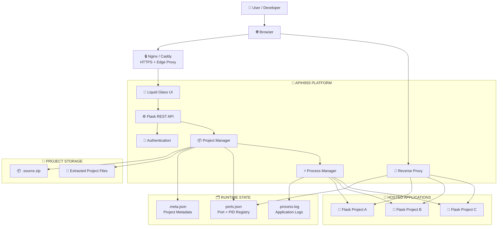
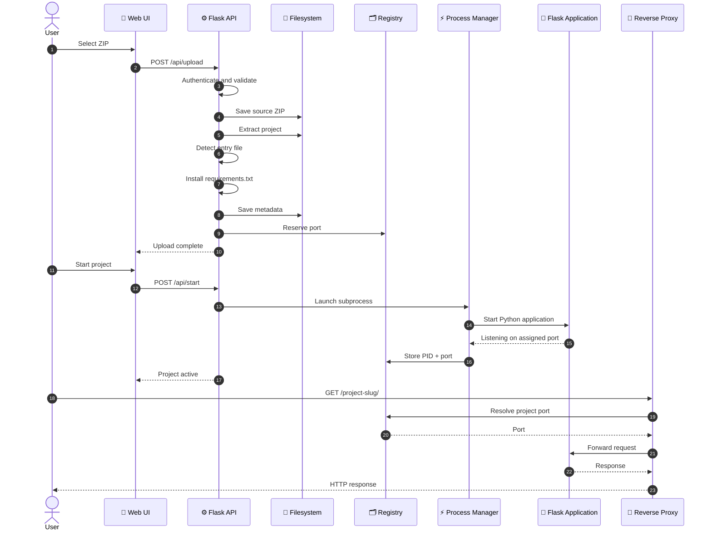
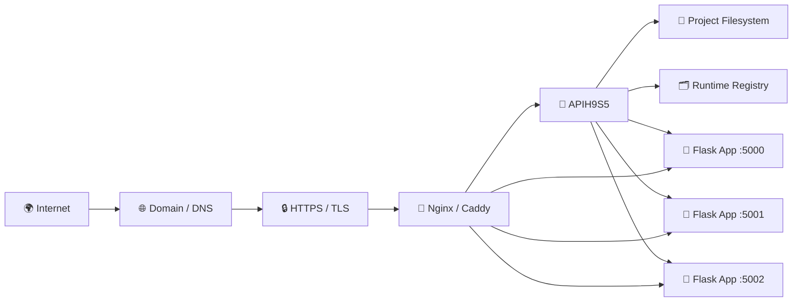
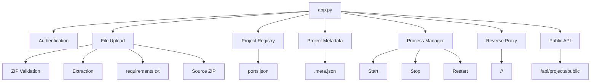

<p align="center">
  
</p>

<h1 align="center"><b>APIH9S5</b></h1>
<p align="center"><b>Flask Application Hosting & Deployment Platform</b></p>
<p align="center"><b>Liquid Glass UI · Secure Admin Panel · ZIP Deployment · Process Management · Reverse Proxy · Public Project Gallery</b></p>

<p align="center">
  
  
  
  
</p>

<p align="center"><b>A lightweight self-hosted platform for uploading, deploying, managing, and exposing independent Flask applications through project slugs.</b></p>

---

## <b>📖 Overview</b>

<b>APIH9S5</b> is a lightweight Python/Flask application hosting platform built around:

<b>Upload ZIP → Extract → Install Dependencies → Detect Entry Point → Assign Port → Start Process → Expose Through Slug</b>

<b>The platform uses a JSON + filesystem architecture instead of a traditional database, making it easy to inspect, back up, move, and run on a Linux server, VPS, or Termux.</b>

---

## <b>✨ Core Features</b>

| <b>Feature</b> | <b>Description</b> |
|---|---|
| 📦 <b>ZIP Deployment</b> | <b>Drag-and-drop uploads, ZIP extraction, dependency installation, and source preservation.</b> |
| 🚀 <b>Automatic Startup</b> | <b>Detects common Python entry files and launches applications as managed subprocesses.</b> |
| 🔌 <b>Reverse Proxy</b> | <b>Exposes running applications through `/<slug>/...` routing.</b> |
| 🔐 <b>Admin Authentication</b> | <b>Bearer-token protected management endpoints.</b> |
| 🧩 <b>Project Lifecycle</b> | <b>Start, stop, restart, edit, inspect logs, and delete projects.</b> |
| 🌐 <b>Public Gallery</b> | <b>Displays active projects with title, description, screenshot, and external information.</b> |
| 💾 <b>Zero Database</b> | <b>Project metadata and runtime registry use JSON and the filesystem.</b> |
| 📱 <b>Termux Friendly</b> | <b>Designed with restricted process inspection environments in mind.</b> |

---

## <b>🏗️ System Architecture</b>



---

## <b>🔗 Component Relationships</b>


<b>GitHub supports Mermaid diagrams in Markdown, making these diagrams version-controlled with the repository.</b>

---

## <b>🔄 Deployment Lifecycle</b>



---

## <b>📦 Supported Project Structure</b>

```text
my-project.zip
├── main.py
├── requirements.txt
├── static/
├── templates/
└── ...
```

<b>Common entry files:</b>

```text
main.py
app.py
run.py
index.py
server.py
```

<b>The application can receive its assigned port through the command line or `PORT` environment variable.</b>

```python
import os
import sys
from flask import Flask

app = Flask(__name__)

port = int(
    sys.argv[1].split("=")[1]
    if len(sys.argv) > 1
    else os.getenv("PORT", 5000)
)

@app.route("/")
def home():
    return "Hello from APIH9S5!"

if __name__ == "__main__":
    app.run(host="0.0.0.0", port=port)
```

---

## <b>🔀 Reverse Proxy</b>

<b>Running projects are exposed through their project slug:</b>

```text
http://HOST:8080/<slug>/
```

<b>Example:</b>

```text
http://127.0.0.1:8080/my-project/
```

<b>The proxy forwards GET, POST, PUT, DELETE, PATCH, OPTIONS, HEAD, headers, cookies, request bodies, and query strings.</b>

### <b>Reserved Slugs</b>

<b>Do not use platform routes such as `api` as a project slug.</b>

<b>Recommended:</b>

```text
my-app
test-project
demo
upload-test
```

---

## <b>📡 API Reference</b>

| <b>Method</b> | <b>Endpoint</b> | <b>Auth</b> | <b>Purpose</b> |
|---|---|---|---|
| `POST` | `/api/auth` | <b>No</b> | <b>Authenticate administrator</b> |
| `POST` | `/api/upload` | <b>Yes</b> | <b>Upload ZIP project</b> |
| `POST` | `/api/start` | <b>Yes</b> | <b>Start project</b> |
| `POST` | `/api/stop` | <b>Yes</b> | <b>Stop project</b> |
| `POST` | `/api/restart` | <b>Yes</b> | <b>Restart project</b> |
| `POST` | `/api/projects/&lt;slug&gt;/edit` | <b>Yes</b> | <b>Edit metadata</b> |
| `DELETE` | `/api/projects/&lt;slug&gt;` | <b>Yes</b> | <b>Delete project</b> |
| `GET` | `/api/projects` | <b>Yes</b> | <b>List projects</b> |
| `GET` | `/api/projects/public` | <b>No</b> | <b>Public projects</b> |
| `GET` | `/api/download/&lt;slug&gt;` | <b>Yes</b> | <b>Download source ZIP</b> |
| `GET` | `/api/logs/&lt;slug&gt;` | <b>Yes</b> | <b>Read process logs</b> |

---

## <b>🗂️ Repository Structure</b>

```text
APIH9S5/
├── app.py
├── .env
├── .env.example
├── ports.json
├── requirements.txt
├── README.md
│
├── projects/
│   └── {slug}/
│       ├── main.py
│       ├── requirements.txt
│       ├── .source.zip
│       ├── .meta.json
│       └── .process.log
│
└── public/
    ├── index.html
    ├── bg-admin.jpg
    ├── bg-user.jpg
    └── logo.png
```

---

## <b>⚙️ Installation</b>

### <b>Requirements</b>

```text
Python 3.10+
Flask
Requests
psutil
python-dotenv
```

### <b>Install</b>

```bash
pip install -r requirements.txt
cp .env.example .env
```

### <b>Configure</b>

```env
ADMIN_PASSWORD=change-this-password
SECRET_KEY=change-this-secret
FLASK_PORT=8080
```

### <b>Run</b>

```bash
python app.py
```

<b>Default address:</b>

```text
http://127.0.0.1:8080
```

---

## <b>🖥️ Web Interface</b>

### <b>Admin Panel</b>

```text
/#/9x
```

<b>Includes project management, ZIP upload, start/stop/restart, deletion, logs, and metadata editing.</b>

### <b>Public Gallery</b>

```text
/
```

<b>Displays active projects and public metadata.</b>

---

## <b>🔧 Port & Process Management</b>

<b>APIH9S5 searches for an available port starting from `5000` and stores runtime information in `ports.json`.</b>

```json
{
  "my-project": {
    "port": 5000,
    "pid": 12345,
    "entry_file": "main.py"
  }
}
```

<b>Managed lifecycle:</b>

```text
START
STOP
RESTART
DELETE
```

---

## <b>🔐 Security</b>

<b>Before public deployment:</b>

1. <b>Change the default admin password.</b>
2. <b>Use a strong random `SECRET_KEY`.</b>
3. <b>Use HTTPS.</b>
4. <b>Place APIH9S5 behind Nginx, Caddy, or another production proxy.</b>
5. <b>Restrict upload size and file types.</b>
6. <b>Never execute untrusted uploaded code without isolation.</b>
7. <b>Consider container-based sandboxing for multi-user hosting.</b>
8. <b>Prevent uploaded projects from exposing sensitive `.env` files.</b>

> <b>⚠️ IMPORTANT:</b> <b>APIH9S5 executes uploaded Python applications as subprocesses. Treat uploaded code as untrusted code.</b>

---

## <b>🚀 Production Deployment</b>



---

## <b>🛠️ Technology Stack</b>

| <b>Layer</b> | <b>Technology</b> |
|---|---|
| <b>Backend</b> | <b>Python</b> |
| <b>Framework</b> | <b>Flask</b> |
| <b>Frontend</b> | <b>HTML / CSS / Vanilla JavaScript</b> |
| <b>HTTP Proxy</b> | <b>Requests</b> |
| <b>Process Management</b> | <b>psutil + subprocess</b> |
| <b>Configuration</b> | <b>python-dotenv</b> |
| <b>Storage</b> | <b>JSON + Filesystem</b> |
| <b>UI</b> | <b>Liquid Glass / Glassmorphism</b> |
| <b>Deployment</b> | <b>Subprocess-based Flask Hosting</b> |

---

## <b>📊 Internal Architecture</b>



---

## <b>📌 Design Philosophy</b>

<b>APIH9S5 deliberately avoids a traditional database for its core project registry.</b>

```text
Project Files       → projects/
Project Metadata    → .meta.json
Port / PID Registry → ports.json
Process Output      → .process.log
Source Archive      → .source.zip
```

<b>This keeps the platform lightweight, transparent, portable, and easy to back up.</b>

---

## <b>📍 Roadmap</b>

```text
[x] ZIP project upload
[x] Automatic extraction
[x] Entry-file detection
[x] requirements.txt installation
[x] Automatic port allocation
[x] Process lifecycle management
[x] Reverse proxy routing
[x] Admin authentication
[x] Public project gallery
[x] Project metadata management
[x] Project logs
[ ] Container isolation
[ ] Per-project resource limits
[ ] Persistent database backend
[ ] HTTPS automation
[ ] Multi-user accounts
[ ] Project health monitoring
```

---

## <b>🤝 Contributing</b>

<b>Contributions, improvements, bug reports, and architecture ideas are welcome.</b>

```text
1. Fork the repository
2. Create a feature branch
3. Make your changes
4. Test locally
5. Commit your changes
6. Open a Pull Request
```

---

## <b>📜 License</b>

<b>MIT License — Built for the community.</b>

---

<h2 align="center"><b>🚀 APIH9S5</b></h2>

<p align="center"><b>UPLOAD · DEPLOY · MANAGE · PROXY · HOST</b></p>

<p align="center"><b>A lightweight Flask-based application hosting platform with a Liquid Glass interface, project lifecycle management, process supervision, and slug-based reverse proxy routing.</b></p>

<p align="center">
  
</p>
