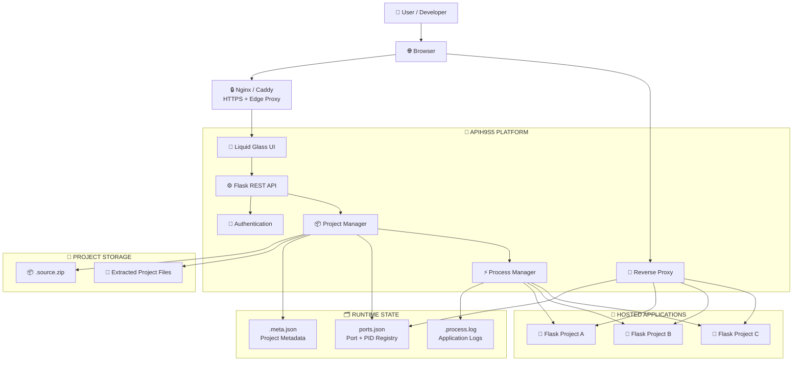
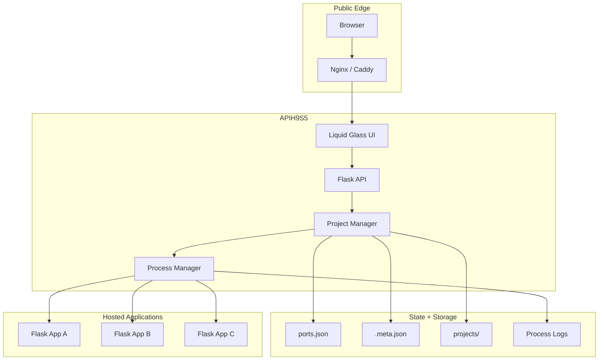
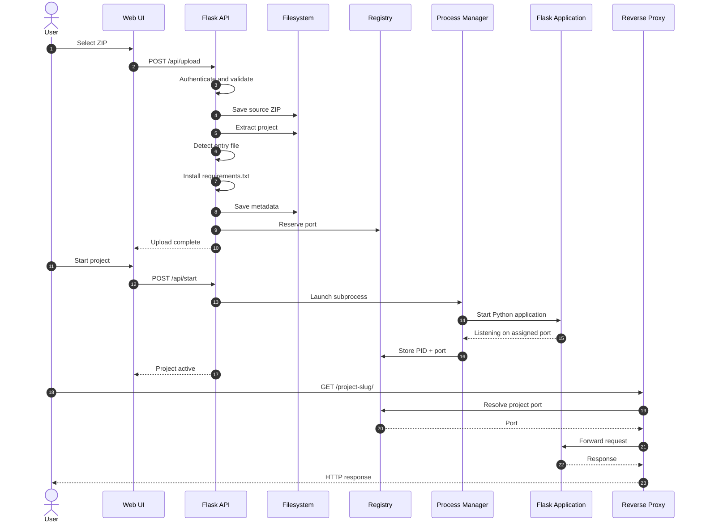
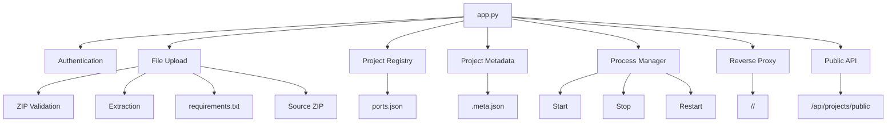

# **𝐀𝐏𝐈𝐇𝟗𝐒𝟓**

<p align="center">  
    
</p>

<h1 align="center"><b>𝐀𝐏𝐈𝐇𝟗𝐒𝟓</b></h1>
<p align="center"><b>𝐅𝐥𝐚𝐬𝐤 𝐀𝐩𝐩𝐥𝐢𝐜𝐚𝐭𝐢𝐨𝐧 𝐇𝐨𝐬𝐭𝐢𝐧𝐠 & 𝐃𝐞𝐩𝐥𝐨𝐲𝐦𝐞𝐧𝐭 𝐏𝐥𝐚𝐭𝐟𝐨𝐫𝐦</b></p>
<p align="center"><b>𝐋𝐢𝐪𝐮𝐢𝐝 𝐆𝐥𝐚𝐬𝐬 𝐔𝐈 · 𝐒𝐞𝐜𝐮𝐫𝐞 𝐀𝐝𝐦𝐢𝐧 𝐏𝐚𝐧𝐞𝐥 · 𝐙𝐈𝐏 𝐃𝐞𝐩𝐥𝐨𝐲𝐦𝐞𝐧𝐭 · 𝐏𝐫𝐨𝐜𝐞𝐬𝐬 𝐌𝐚𝐧𝐚𝐠𝐞𝐦𝐞𝐧𝐭 · 𝐑𝐞𝐯𝐞𝐫𝐬𝐞 𝐏𝐫𝐨𝐱𝐲 · 𝐏𝐮𝐛𝐥𝐢𝐜 𝐏𝐫𝐨𝐣𝐞𝐜𝐭 𝐆𝐚𝐥𝐥𝐞𝐫𝐲</b></p>

<p align="center">
  
  
  
  
</p>

<p align="center"><b>𝐀 𝐥𝐢𝐠𝐡𝐭𝐰𝐞𝐢𝐠𝐡𝐭 𝐬𝐞𝐥𝐟-𝐡𝐨𝐬𝐭𝐞𝐝 𝐩𝐥𝐚𝐭𝐟𝐨𝐫𝐦 𝐟𝐨𝐫 𝐮𝐩𝐥𝐨𝐚𝐝𝐢𝐧𝐠, 𝐝𝐞𝐩𝐥𝐨𝐲𝐢𝐧𝐠, 𝐦𝐚𝐧𝐚𝐠𝐢𝐧𝐠, 𝐚𝐧𝐝 𝐞𝐱𝐩𝐨𝐬𝐢𝐧𝐠 𝐢𝐧𝐝𝐞𝐩𝐞𝐧𝐝𝐞𝐧𝐭 𝐅𝐥𝐚𝐬𝐤 𝐚𝐩𝐩𝐥𝐢𝐜𝐚𝐭𝐢𝐨𝐧𝐬 𝐭𝐡𝐫𝐨𝐮𝐠𝐡 𝐩𝐫𝐨𝐣𝐞𝐜𝐭 𝐬𝐥𝐮𝐠𝐬.</b></p>

---

## **📖 𝐎𝐯𝐞𝐫𝐯𝐢𝐞𝐰**

**𝐀𝐏𝐈𝐇𝟗𝐒𝟓** 𝐢𝐬 𝐚 𝐥𝐢𝐠𝐡𝐭𝐰𝐞𝐢𝐠𝐡𝐭 𝐏𝐲𝐭𝐡𝐨𝐧/𝐅𝐥𝐚𝐬𝐤 𝐚𝐩𝐩𝐥𝐢𝐜𝐚𝐭𝐢𝐨𝐧 𝐡𝐨𝐬𝐭𝐢𝐧𝐠 𝐩𝐥𝐚𝐭𝐟𝐨𝐫𝐦 𝐛𝐮𝐢𝐥𝐭 𝐚𝐫𝐨𝐮𝐧𝐝:

**𝐔𝐩𝐥𝐨𝐚𝐝 𝐙𝐈𝐏 → 𝐄𝐱𝐭𝐫𝐚𝐜𝐭 → 𝐈𝐧𝐬𝐭𝐚𝐥𝐥 𝐃𝐞𝐩𝐞𝐧𝐝𝐞𝐧𝐜𝐢𝐞𝐬 → 𝐃𝐞𝐭𝐞𝐜𝐭 𝐄𝐧𝐭𝐫𝐲 𝐏𝐨𝐢𝐧𝐭 → 𝐀𝐬𝐬𝐢𝐠𝐧 𝐏𝐨𝐫𝐭 → 𝐒𝐭𝐚𝐫𝐭 𝐏𝐫𝐨𝐜𝐞𝐬𝐬 → 𝐄𝐱𝐩𝐨𝐬𝐞 𝐓𝐡𝐫𝐨𝐮𝐠𝐡 𝐒𝐥𝐮𝐠**

**𝐓𝐡𝐞 𝐩𝐥𝐚𝐭𝐟𝐨𝐫𝐦 𝐮𝐬𝐞𝐬 𝐚 𝐉𝐒𝐎𝐍 + 𝐟𝐢𝐥𝐞𝐬𝐲𝐬𝐭𝐞𝐦 𝐚𝐫𝐜𝐡𝐢𝐭𝐞𝐜𝐭𝐮𝐫𝐞 𝐢𝐧𝐬𝐭𝐞𝐚𝐝 𝐨𝐟 𝐚 𝐭𝐫𝐚𝐝𝐢𝐭𝐢𝐨𝐧𝐚𝐥 𝐝𝐚𝐭𝐚𝐛𝐚𝐬𝐞, 𝐦𝐚𝐤𝐢𝐧𝐠 𝐢𝐭 𝐞𝐚𝐬𝐲 𝐭𝐨 𝐢𝐧𝐬𝐩𝐞𝐜𝐭, 𝐛𝐚𝐜𝐤 𝐮𝐩, 𝐦𝐨𝐯𝐞, 𝐚𝐧𝐝 𝐫𝐮𝐧 𝐨𝐧 𝐚 𝐋𝐢𝐧𝐮𝐱 𝐬𝐞𝐫𝐯𝐞𝐫, 𝐕𝐏𝐒, 𝐨𝐫 𝐓𝐞𝐫𝐦𝐮𝐱.**

---

## **✨ 𝐂𝐨𝐫𝐞 𝐅𝐞𝐚𝐭𝐮𝐫𝐞𝐬**

| **𝐅𝐞𝐚𝐭𝐮𝐫𝐞** | **𝐃𝐞𝐬𝐜𝐫𝐢𝐩𝐭𝐢𝐨𝐧** |
|---|---|
| 📦 **𝐙𝐈𝐏 𝐃𝐞𝐩𝐥𝐨𝐲𝐦𝐞𝐧𝐭** | **𝐃𝐫𝐚𝐠-𝐚𝐧𝐝-𝐝𝐫𝐨𝐩 𝐮𝐩𝐥𝐨𝐚𝐝𝐬, 𝐙𝐈𝐏 𝐞𝐱𝐭𝐫𝐚𝐜𝐭𝐢𝐨𝐧, 𝐝𝐞𝐩𝐞𝐧𝐝𝐞𝐧𝐜𝐲 𝐢𝐧𝐬𝐭𝐚𝐥𝐥𝐚𝐭𝐢𝐨𝐧, 𝐚𝐧𝐝 𝐬𝐨𝐮𝐫𝐜𝐞 𝐩𝐫𝐞𝐬𝐞𝐫𝐯𝐚𝐭𝐢𝐨𝐧.** |
| 🚀 **𝐀𝐮𝐭𝐨𝐦𝐚𝐭𝐢𝐜 𝐒𝐭𝐚𝐫𝐭𝐮𝐩** | **𝐃𝐞𝐭𝐞𝐜𝐭𝐬 𝐜𝐨𝐦𝐦𝐨𝐧 𝐏𝐲𝐭𝐡𝐨𝐧 𝐞𝐧𝐭𝐫𝐲 𝐟𝐢𝐥𝐞𝐬 𝐚𝐧𝐝 𝐥𝐚𝐮𝐧𝐜𝐡𝐞𝐬 𝐚𝐩𝐩𝐥𝐢𝐜𝐚𝐭𝐢𝐨𝐧𝐬 𝐚𝐬 𝐦𝐚𝐧𝐚𝐠𝐞𝐝 𝐬𝐮𝐛𝐩𝐫𝐨𝐜𝐞𝐬𝐬𝐞𝐬.** |
| 🔌 **𝐑𝐞𝐯𝐞𝐫𝐬𝐞 𝐏𝐫𝐨𝐱𝐲** | **𝐄𝐱𝐩𝐨𝐬𝐞𝐬 𝐫𝐮𝐧𝐧𝐢𝐧𝐠 𝐚𝐩𝐩𝐥𝐢𝐜𝐚𝐭𝐢𝐨𝐧𝐬 𝐭𝐡𝐫𝐨𝐮𝐠𝐡 `/<slug>/...` 𝐫𝐨𝐮𝐭𝐢𝐧𝐠.** |
| 🔐 **𝐀𝐝𝐦𝐢𝐧 𝐀𝐮𝐭𝐡𝐞𝐧𝐭𝐢𝐜𝐚𝐭𝐢𝐨𝐧** | **𝐁𝐞𝐚𝐫𝐞𝐫-𝐭𝐨𝐤𝐞𝐧 𝐩𝐫𝐨𝐭𝐞𝐜𝐭𝐞𝐝 𝐦𝐚𝐧𝐚𝐠𝐞𝐦𝐞𝐧𝐭 𝐞𝐧𝐝𝐩𝐨𝐢𝐧𝐭𝐬.** |
| 🧩 **𝐏𝐫𝐨𝐣𝐞𝐜𝐭 𝐋𝐢𝐟𝐞𝐜𝐲𝐜𝐥𝐞** | **𝐒𝐭𝐚𝐫𝐭, 𝐬𝐭𝐨𝐩, 𝐫𝐞𝐬𝐭𝐚𝐫𝐭, 𝐞𝐝𝐢𝐭, 𝐢𝐧𝐬𝐩𝐞𝐜𝐭 𝐥𝐨𝐠𝐬, 𝐚𝐧𝐝 𝐝𝐞𝐥𝐞𝐭𝐞 𝐩𝐫𝐨𝐣𝐞𝐜𝐭𝐬.** |
| 🌐 **𝐏𝐮𝐛𝐥𝐢𝐜 𝐆𝐚𝐥𝐥𝐞𝐫𝐲** | **𝐃𝐢𝐬𝐩𝐥𝐚𝐲𝐬 𝐚𝐜𝐭𝐢𝐯𝐞 𝐩𝐫𝐨𝐣𝐞𝐜𝐭𝐬 𝐰𝐢𝐭𝐡 𝐭𝐢𝐭𝐥𝐞, 𝐝𝐞𝐬𝐜𝐫𝐢𝐩𝐭𝐢𝐨𝐧, 𝐬𝐜𝐫𝐞𝐞𝐧𝐬𝐡𝐨𝐭, 𝐚𝐧𝐝 𝐞𝐱𝐭𝐞𝐫𝐧𝐚𝐥 𝐢𝐧𝐟𝐨𝐫𝐦𝐚𝐭𝐢𝐨𝐧.** |
| 💾 **𝐙𝐞𝐫𝐨 𝐃𝐚𝐭𝐚𝐛𝐚𝐬𝐞** | **𝐏𝐫𝐨𝐣𝐞𝐜𝐭 𝐦𝐞𝐭𝐚𝐝𝐚𝐭𝐚 𝐚𝐧𝐝 𝐫𝐮𝐧𝐭𝐢𝐦𝐞 𝐫𝐞𝐠𝐢𝐬𝐭𝐫𝐲 𝐮𝐬𝐞 𝐉𝐒𝐎𝐍 𝐚𝐧𝐝 𝐭𝐡𝐞 𝐟𝐢𝐥𝐞𝐬𝐲𝐬𝐭𝐞𝐦.** |
| 📱 **𝐓𝐞𝐫𝐦𝐮𝐱 𝐅𝐫𝐢𝐞𝐧𝐝𝐥𝐲** | **𝐃𝐞𝐬𝐢𝐠𝐧𝐞𝐝 𝐰𝐢𝐭𝐡 𝐫𝐞𝐬𝐭𝐫𝐢𝐜𝐭𝐞𝐝 𝐩𝐫𝐨𝐜𝐞𝐬𝐬 𝐢𝐧𝐬𝐩𝐞𝐜𝐭𝐢𝐨𝐧 𝐞𝐧𝐯𝐢𝐫𝐨𝐧𝐦𝐞𝐧𝐭𝐬 𝐢𝐧 𝐦𝐢𝐧𝐝.** |

---

## **🏗️ 𝐒𝐲𝐬𝐭𝐞𝐦 𝐀𝐫𝐜𝐡𝐢𝐭𝐞𝐜𝐭𝐮𝐫𝐞**



---

## **🔗 𝐂𝐨𝐦𝐩𝐨𝐧𝐞𝐧𝐭 𝐑𝐞𝐥𝐚𝐭𝐢𝐨𝐧𝐬𝐡𝐢𝐩𝐬**



**GitHub supports Mermaid diagrams in Markdown, making these diagrams version-controlled with the repository.**

---

## **🔄 𝐃𝐞𝐩𝐥𝐨𝐲𝐦𝐞𝐧𝐭 𝐋𝐢𝐟𝐞𝐜𝐲𝐜𝐥𝐞**



---

## **📦 𝐒𝐮𝐩𝐩𝐨𝐫𝐭𝐞𝐝 𝐏𝐫𝐨𝐣𝐞𝐜𝐭 𝐒𝐭𝐫𝐮𝐜𝐭𝐮𝐫𝐞**

```text
my-project.zip
├── main.py
├── requirements.txt
├── static/
├── templates/
└── ...
```

**𝐂𝐨𝐦𝐦𝐨𝐧 𝐞𝐧𝐭𝐫𝐲 𝐟𝐢𝐥𝐞𝐬:**

```text
main.py
app.py
run.py
index.py
server.py
```

**𝐓𝐡𝐞 𝐚𝐩𝐩𝐥𝐢𝐜𝐚𝐭𝐢𝐨𝐧 𝐜𝐚𝐧 𝐫𝐞𝐜𝐞𝐢𝐯𝐞 𝐢𝐭𝐬 𝐚𝐬𝐬𝐢𝐠𝐧𝐞𝐝 𝐩𝐨𝐫𝐭 𝐭𝐡𝐫𝐨𝐮𝐠𝐡 𝐭𝐡𝐞 𝐜𝐨𝐦𝐦𝐚𝐧𝐝 𝐥𝐢𝐧𝐞 𝐨𝐫 `PORT` 𝐞𝐧𝐯𝐢𝐫𝐨𝐧𝐦𝐞𝐧𝐭 𝐯𝐚𝐫𝐢𝐚𝐛𝐥𝐞.**

```python
import os
import sys
from flask import Flask

app = Flask(__name__)

port = int(
    sys.argv[1].split("=")[1]
    if len(sys.argv) > 1
    else os.getenv("PORT", 5000)
)

@app.route("/")
def home():
    return "Hello from APIH9S5!"

if __name__ == "__main__":
    app.run(host="0.0.0.0", port=port)
```

---

## **🔀 𝐑𝐞𝐯𝐞𝐫𝐬𝐞 𝐏𝐫𝐨𝐱𝐲**

**𝐑𝐮𝐧𝐧𝐢𝐧𝐠 𝐩𝐫𝐨𝐣𝐞𝐜𝐭𝐬 𝐚𝐫𝐞 𝐞𝐱𝐩𝐨𝐬𝐞𝐝 𝐭𝐡𝐫𝐨𝐮𝐠𝐡 𝐭𝐡𝐞𝐢𝐫 𝐩𝐫𝐨𝐣𝐞𝐜𝐭 𝐬𝐥𝐮𝐠:**

```text
http://HOST:8080/<slug>/
```

**𝐄𝐱𝐚𝐦𝐩𝐥𝐞:**

```text
http://127.0.0.1:8080/my-project/
```

**𝐓𝐡𝐞 𝐩𝐫𝐨𝐱𝐲 𝐟𝐨𝐫𝐰𝐚𝐫𝐝𝐬 𝐆𝐄𝐓, 𝐏𝐎𝐒𝐓, 𝐏𝐔𝐓, 𝐃𝐄𝐋𝐄𝐓𝐄, 𝐏𝐀𝐓𝐂𝐇, 𝐎𝐏𝐓𝐈𝐎𝐍𝐒, 𝐇𝐄𝐀𝐃, 𝐡𝐞𝐚𝐝𝐞𝐫𝐬, 𝐜𝐨𝐨𝐤𝐢𝐞𝐬, 𝐫𝐞𝐪𝐮𝐞𝐬𝐭 𝐛𝐨𝐝𝐢𝐞𝐬, 𝐚𝐧𝐝 𝐪𝐮𝐞𝐫𝐲 𝐬𝐭𝐫𝐢𝐧𝐠𝐬.**

### **𝐑𝐞𝐬𝐞𝐫𝐯𝐞𝐝 𝐒𝐥𝐮𝐠𝐬**

**𝐃𝐨 𝐧𝐨𝐭 𝐮𝐬𝐞 𝐩𝐥𝐚𝐭𝐟𝐨𝐫𝐦 𝐫𝐨𝐮𝐭𝐞𝐬 𝐬𝐮𝐜𝐡 𝐚𝐬 `api` 𝐚𝐬 𝐚 𝐩𝐫𝐨𝐣𝐞𝐜𝐭 𝐬𝐥𝐮𝐠.**

**𝐑𝐞𝐜𝐨𝐦𝐦𝐞𝐧𝐝𝐞𝐝:**

```text
my-app
test-project
demo
upload-test
```

---

## **📡 𝐀𝐏𝐈 𝐑𝐞𝐟𝐞𝐫𝐞𝐧𝐜𝐞**

| **𝐌𝐞𝐭𝐡𝐨𝐝** | **𝐄𝐧𝐝𝐩𝐨𝐢𝐧𝐭** | **𝐀𝐮𝐭𝐡** | **𝐏𝐮𝐫𝐩𝐨𝐬𝐞** |
|---|---|---|---|
| `POST` | `/api/auth` | **𝐍𝐨** | **𝐀𝐮𝐭𝐡𝐞𝐧𝐭𝐢𝐜𝐚𝐭𝐞 𝐚𝐝𝐦𝐢𝐧𝐢𝐬𝐭𝐫𝐚𝐭𝐨𝐫** |
| `POST` | `/api/upload` | **𝐘𝐞𝐬** | **𝐔𝐩𝐥𝐨𝐚𝐝 𝐙𝐈𝐏 𝐩𝐫𝐨𝐣𝐞𝐜𝐭** |
| `POST` | `/api/start` | **𝐘𝐞𝐬** | **𝐒𝐭𝐚𝐫𝐭 𝐩𝐫𝐨𝐣𝐞𝐜𝐭** |
| `POST` | `/api/stop` | **𝐘𝐞𝐬** | **𝐒𝐭𝐨𝐩 𝐩𝐫𝐨𝐣𝐞𝐜𝐭** |
| `POST` | `/api/restart` | **𝐘𝐞𝐬** | **𝐑𝐞𝐬𝐭𝐚𝐫𝐭 𝐩𝐫𝐨𝐣𝐞𝐜𝐭** |
| `POST` | `/api/projects/<slug>/edit` | **𝐘𝐞𝐬** | **𝐄𝐝𝐢𝐭 𝐦𝐞𝐭𝐚𝐝𝐚𝐭𝐚** |
| `DELETE` | `/api/projects/<slug>` | **𝐘𝐞𝐬** | **𝐃𝐞𝐥𝐞𝐭𝐞 𝐩𝐫𝐨𝐣𝐞𝐜𝐭** |
| `GET` | `/api/projects` | **𝐘𝐞𝐬** | **𝐋𝐢𝐬𝐭 𝐩𝐫𝐨𝐣𝐞𝐜𝐭𝐬** |
| `GET` | `/api/projects/public` | **𝐍𝐨** | **𝐏𝐮𝐛𝐥𝐢𝐜 𝐩𝐫𝐨𝐣𝐞𝐜𝐭𝐬** |
| `GET` | `/api/download/<slug>` | **𝐘𝐞𝐬** | **𝐃𝐨𝐰𝐧𝐥𝐨𝐚𝐝 𝐬𝐨𝐮𝐫𝐜𝐞 𝐙𝐈𝐏** |
| `GET` | `/api/logs/<slug>` | **𝐘𝐞𝐬** | **𝐑𝐞𝐚𝐝 𝐩𝐫𝐨𝐜𝐞𝐬𝐬 𝐥𝐨𝐠𝐬** |

---

## **🗂️ 𝐑𝐞𝐩𝐨𝐬𝐢𝐭𝐨𝐫𝐲 𝐒𝐭𝐫𝐮𝐜𝐭𝐮𝐫𝐞**

```text
APIH9S5/
├── app.py
├── .env
├── .env.example
├── ports.json
├── requirements.txt
├── README.md
│
├── projects/
│   └── {slug}/
│       ├── main.py
│       ├── requirements.txt
│       ├── .source.zip
│       ├── .meta.json
│       └── .process.log
│
└── public/
    ├── index.html
    ├── bg-admin.jpg
    ├── bg-user.jpg
    └── logo.png
```

---

## **⚙️ 𝐈𝐧𝐬𝐭𝐚𝐥𝐥𝐚𝐭𝐢𝐨𝐧**

### **𝐑𝐞𝐪𝐮𝐢𝐫𝐞𝐦𝐞𝐧𝐭𝐬**

```text
Python 3.10+
Flask
Requests
psutil
python-dotenv
```

### **𝐈𝐧𝐬𝐭𝐚𝐥𝐥**

```bash
pip install -r requirements.txt
cp .env.example .env
```

### **𝐂𝐨𝐧𝐟𝐢𝐠𝐮𝐫𝐞**

```env
ADMIN_PASSWORD=change-this-password
SECRET_KEY=change-this-secret
FLASK_PORT=8080
```

### **𝐑𝐮𝐧**

```bash
python app.py
```

**𝐃𝐞𝐟𝐚𝐮𝐥𝐭 𝐚𝐝𝐝𝐫𝐞𝐬𝐬:**

```text
http://127.0.0.1:8080
```

---

## **🖥️ 𝐖𝐞𝐛 𝐈𝐧𝐭𝐞𝐫𝐟𝐚𝐜𝐞**

### **𝐀𝐝𝐦𝐢𝐧 𝐏𝐚𝐧𝐞𝐥**

```text
/#/9x
```

**𝐈𝐧𝐜𝐥𝐮𝐝𝐞𝐬 𝐩𝐫𝐨𝐣𝐞𝐜𝐭 𝐦𝐚𝐧𝐚𝐠𝐞𝐦𝐞𝐧𝐭, 𝐙𝐈𝐏 𝐮𝐩𝐥𝐨𝐚𝐝, 𝐬𝐭𝐚𝐫𝐭/𝐬𝐭𝐨𝐩/𝐫𝐞𝐬𝐭𝐚𝐫𝐭, 𝐝𝐞𝐥𝐞𝐭𝐢𝐨𝐧, 𝐥𝐨𝐠𝐬, 𝐚𝐧𝐝 𝐦𝐞𝐭𝐚𝐝𝐚𝐭𝐚 𝐞𝐝𝐢𝐭𝐢𝐧𝐠.**

### **𝐏𝐮𝐛𝐥𝐢𝐜 𝐆𝐚𝐥𝐥𝐞𝐫𝐲**

```text
/
```

**𝐃𝐢𝐬𝐩𝐥𝐚𝐲𝐬 𝐚𝐜𝐭𝐢𝐯𝐞 𝐩𝐫𝐨𝐣𝐞𝐜𝐭𝐬 𝐚𝐧𝐝 𝐩𝐮𝐛𝐥𝐢𝐜 𝐦𝐞𝐭𝐚𝐝𝐚𝐭𝐚.**

---

## **🔧 𝐏𝐨𝐫𝐭 & 𝐏𝐫𝐨𝐜𝐞𝐬𝐬 𝐌𝐚𝐧𝐚𝐠𝐞𝐦𝐞𝐧𝐭**

**𝐀𝐏𝐈𝐇𝟗𝐒𝟓 𝐬𝐞𝐚𝐫𝐜𝐡𝐞𝐬 𝐟𝐨𝐫 𝐚𝐧 𝐚𝐯𝐚𝐢𝐥𝐚𝐛𝐥𝐞 𝐩𝐨𝐫𝐭 𝐬𝐭𝐚𝐫𝐭𝐢𝐧𝐠 𝐟𝐫𝐨𝐦 `5000` 𝐚𝐧𝐝 𝐬𝐭𝐨𝐫𝐞𝐬 𝐫𝐮𝐧𝐭𝐢𝐦𝐞 𝐢𝐧𝐟𝐨𝐫𝐦𝐚𝐭𝐢𝐨𝐧 𝐢𝐧 `ports.json`.**

```json
{
  "my-project": {
    "port": 5000,
    "pid": 12345,
    "entry_file": "main.py"
  }
}
```

**𝐌𝐚𝐧𝐚𝐠𝐞𝐝 𝐥𝐢𝐟𝐞𝐜𝐲𝐜𝐥𝐞:**

```text
START
STOP
RESTART
DELETE
```

---

## **🔐 𝐒𝐞𝐜𝐮𝐫𝐢𝐭𝐲**

**𝐁𝐞𝐟𝐨𝐫𝐞 𝐩𝐮𝐛𝐥𝐢𝐜 𝐝𝐞𝐩𝐥𝐨𝐲𝐦𝐞𝐧𝐭:**

𝟏. **𝐂𝐡𝐚𝐧𝐠𝐞 𝐭𝐡𝐞 𝐝𝐞𝐟𝐚𝐮𝐥𝐭 𝐚𝐝𝐦𝐢𝐧 𝐩𝐚𝐬𝐬𝐰𝐨𝐫𝐝.**  
𝟐. **𝐔𝐬𝐞 𝐚 𝐬𝐭𝐫𝐨𝐧𝐠 𝐫𝐚𝐧𝐝𝐨𝐦 `SECRET_KEY`.**  
𝟑. **𝐔𝐬𝐞 𝐇𝐓𝐓𝐏𝐒.**  
𝟒. **𝐏𝐥𝐚𝐜𝐞 𝐀𝐏𝐈𝐇𝟗𝐒𝟓 𝐛𝐞𝐡𝐢𝐧𝐝 𝐍𝐠𝐢𝐧𝐱, 𝐂𝐚𝐝𝐝𝐲, 𝐨𝐫 𝐚𝐧𝐨𝐭𝐡𝐞𝐫 𝐩𝐫𝐨𝐝𝐮𝐜𝐭𝐢𝐨𝐧 𝐩𝐫𝐨𝐱𝐲.**  
𝟓. **𝐑𝐞𝐬𝐭𝐫𝐢𝐜𝐭 𝐮𝐩𝐥𝐨𝐚𝐝 𝐬𝐢𝐳𝐞 𝐚𝐧𝐝 𝐟𝐢𝐥𝐞 𝐭𝐲𝐩𝐞𝐬.**  
𝟔. **𝐍𝐞𝐯𝐞𝐫 𝐞𝐱𝐞𝐜𝐮𝐭𝐞 𝐮𝐧𝐭𝐫𝐮𝐬𝐭𝐞𝐝 𝐮𝐩𝐥𝐨𝐚𝐝𝐞𝐝 𝐜𝐨𝐝𝐞 𝐰𝐢𝐭𝐡𝐨𝐮𝐭 𝐢𝐬𝐨𝐥𝐚𝐭𝐢𝐨𝐧.**  
𝟕. **𝐂𝐨𝐧𝐬𝐢𝐝𝐞𝐫 𝐜𝐨𝐧𝐭𝐚𝐢𝐧𝐞𝐫-𝐛𝐚𝐬𝐞𝐝 𝐬𝐚𝐧𝐝𝐛𝐨𝐱𝐢𝐧𝐠 𝐟𝐨𝐫 𝐦𝐮𝐥𝐭𝐢-𝐮𝐬𝐞𝐫 𝐡𝐨𝐬𝐭𝐢𝐧𝐠.**  
𝟖. **𝐏𝐫𝐞𝐯𝐞𝐧𝐭 𝐮𝐩𝐥𝐨𝐚𝐝𝐞𝐝 𝐩𝐫𝐨𝐣𝐞𝐜𝐭𝐬 𝐟𝐫𝐨𝐦 𝐞𝐱𝐩𝐨𝐬𝐢𝐧𝐠 𝐬𝐞𝐧𝐬𝐢𝐭𝐢𝐯𝐞 `.env` 𝐟𝐢𝐥𝐞𝐬.**

> **⚠️ 𝐈𝐌𝐏𝐎𝐑𝐓𝐀𝐍𝐓:** **𝐀𝐏𝐈𝐇𝟗𝐒𝟓 𝐞𝐱𝐞𝐜𝐮𝐭𝐞𝐬 𝐮𝐩𝐥𝐨𝐚𝐝𝐞𝐝 𝐏𝐲𝐭𝐡𝐨𝐧 𝐚𝐩𝐩𝐥𝐢𝐜𝐚𝐭𝐢𝐨𝐧𝐬 𝐚𝐬 𝐬𝐮𝐛𝐩𝐫𝐨𝐜𝐞𝐬𝐬𝐞𝐬. 𝐓𝐫𝐞𝐚𝐭 𝐮𝐩𝐥𝐨𝐚𝐝𝐞𝐝 𝐜𝐨𝐝𝐞 𝐚𝐬 𝐮𝐧𝐭𝐫𝐮𝐬𝐭𝐞𝐝 𝐜𝐨𝐝𝐞.**

---

## **🚀 𝐏𝐫𝐨𝐝𝐮𝐜𝐭𝐢𝐨𝐧 𝐃𝐞𝐩𝐥𝐨𝐲𝐦𝐞𝐧𝐭**


---

## **🛠️ 𝐓𝐞𝐜𝐡𝐧𝐨𝐥𝐨𝐠𝐲 𝐒𝐭𝐚𝐜𝐤**

| **𝐋𝐚𝐲𝐞𝐫** | **𝐓𝐞𝐜𝐡𝐧𝐨𝐥𝐨𝐠𝐲** |
|---|---|
| **𝐁𝐚𝐜𝐤𝐞𝐧𝐝** | **𝐏𝐲𝐭𝐡𝐨𝐧** |
| **𝐅𝐫𝐚𝐦𝐞𝐰𝐨𝐫𝐤** | **𝐅𝐥𝐚𝐬𝐤** |
| **𝐅𝐫𝐨𝐧𝐭𝐞𝐧𝐝** | **𝐇𝐓𝐌𝐋 / 𝐂𝐒𝐒 / 𝐕𝐚𝐧𝐢𝐥𝐥𝐚 𝐉𝐚𝐯𝐚𝐒𝐜𝐫𝐢𝐩𝐭** |
| **𝐇𝐓𝐓𝐏 𝐏𝐫𝐨𝐱𝐲** | **𝐑𝐞𝐪𝐮𝐞𝐬𝐭𝐬** |
| **𝐏𝐫𝐨𝐜𝐞𝐬𝐬 𝐌𝐚𝐧𝐚𝐠𝐞𝐦𝐞𝐧𝐭** | **𝐩𝐬𝐮𝐭𝐢𝐥 + 𝐬𝐮𝐛𝐩𝐫𝐨𝐜𝐞𝐬𝐬** |
| **𝐂𝐨𝐧𝐟𝐢𝐠𝐮𝐫𝐚𝐭𝐢𝐨𝐧** | **𝐩𝐲𝐭𝐡𝐨𝐧-𝐝𝐨𝐭𝐞𝐧𝐯** |
| **𝐒𝐭𝐨𝐫𝐚𝐠𝐞** | **𝐉𝐒𝐎𝐍 + 𝐅𝐢𝐥𝐞𝐬𝐲𝐬𝐭𝐞𝐦** |
| **𝐔𝐈** | **𝐋𝐢𝐪𝐮𝐢𝐝 𝐆𝐥𝐚𝐬𝐬 / 𝐆𝐥𝐚𝐬𝐬𝐦𝐨𝐫𝐩𝐡𝐢𝐬𝐦** |
| **𝐃𝐞𝐩𝐥𝐨𝐲𝐦𝐞𝐧𝐭** | **𝐒𝐮𝐛𝐩𝐫𝐨𝐜𝐞𝐬𝐬-𝐛𝐚𝐬𝐞𝐝 𝐅𝐥𝐚𝐬𝐤 𝐇𝐨𝐬𝐭𝐢𝐧𝐠** |

---

## **📊 𝐈𝐧𝐭𝐞𝐫𝐧𝐚𝐥 𝐀𝐫𝐜𝐡𝐢𝐭𝐞𝐜𝐭𝐮𝐫𝐞**



---

## **📌 𝐃𝐞𝐬𝐢𝐠𝐧 𝐏𝐡𝐢𝐥𝐨𝐬𝐨𝐩𝐡𝐲**

**𝐀𝐏𝐈𝐇𝟗𝐒𝟓 𝐝𝐞𝐥𝐢𝐛𝐞𝐫𝐚𝐭𝐞𝐥𝐲 𝐚𝐯𝐨𝐢𝐝𝐬 𝐚 𝐭𝐫𝐚𝐝𝐢𝐭𝐢𝐨𝐧𝐚𝐥 𝐝𝐚𝐭𝐚𝐛𝐚𝐬𝐞 𝐟𝐨𝐫 𝐢𝐭𝐬 𝐜𝐨𝐫𝐞 𝐩𝐫𝐨𝐣𝐞𝐜𝐭 𝐫𝐞𝐠𝐢𝐬𝐭𝐫𝐲.**

```text
Project Files       → projects/
Project Metadata    → .meta.json
Port / PID Registry → ports.json
Process Output      → .process.log
Source Archive      → .source.zip
```

**𝐓𝐡𝐢𝐬 𝐤𝐞𝐞𝐩𝐬 𝐭𝐡𝐞 𝐩𝐥𝐚𝐭𝐟𝐨𝐫𝐦 𝐥𝐢𝐠𝐡𝐭𝐰𝐞𝐢𝐠𝐡𝐭, 𝐭𝐫𝐚𝐧𝐬𝐩𝐚𝐫𝐞𝐧𝐭, 𝐩𝐨𝐫𝐭𝐚𝐛𝐥𝐞, 𝐚𝐧𝐝 𝐞𝐚𝐬𝐲 𝐭𝐨 𝐛𝐚𝐜𝐤 𝐮𝐩.**

---

## **📍 𝐑𝐨𝐚𝐝𝐦𝐚𝐩**

```text
[x] ZIP project upload
[x] Automatic extraction
[x] Entry-file detection
[x] requirements.txt installation
[x] Automatic port allocation
[x] Process lifecycle management
[x] Reverse proxy routing
[x] Admin authentication
[x] Public project gallery
[x] Project metadata management
[x] Project logs
[ ] Container isolation
[ ] Per-project resource limits
[ ] Persistent database backend
[ ] HTTPS automation
[ ] Multi-user accounts
[ ] Project health monitoring
```

---

## **🤝 𝐂𝐨𝐧𝐭𝐫𝐢𝐛𝐮𝐭𝐢𝐧𝐠**

**𝐂𝐨𝐧𝐭𝐫𝐢𝐛𝐮𝐭𝐢𝐨𝐧𝐬, 𝐢𝐦𝐩𝐫𝐨𝐯𝐞𝐦𝐞𝐧𝐭𝐬, 𝐛𝐮𝐠 𝐫𝐞𝐩𝐨𝐫𝐭𝐬, 𝐚𝐧𝐝 𝐚𝐫𝐜𝐡𝐢𝐭𝐞𝐜𝐭𝐮𝐫𝐞 𝐢𝐝𝐞𝐚𝐬 𝐚𝐫𝐞 𝐰𝐞𝐥𝐜𝐨𝐦𝐞.**

```text
1. Fork the repository
2. Create a feature branch
3. Make your changes
4. Test locally
5. Commit your changes
6. Open a Pull Request
```

---

## **📜 𝐋𝐢𝐜𝐞𝐧𝐬𝐞**

**𝐌𝐈𝐓 𝐋𝐢𝐜𝐞𝐧𝐬𝐞 — 𝐁𝐮𝐢𝐥𝐭 𝐟𝐨𝐫 𝐭𝐡𝐞 𝐜𝐨𝐦𝐦𝐮𝐧𝐢𝐭𝐲.**

---

<h2 align="center"><b>🚀 𝐀𝐏𝐈𝐇𝟗𝐒𝟓</b></h2>

<p align="center"><b>𝐔𝐏𝐋𝐎𝐀𝐃 · 𝐃𝐄𝐏𝐋𝐎𝐘 · 𝐌𝐀𝐍𝐀𝐆𝐄 · 𝐏𝐑𝐎𝐗𝐘 · 𝐇𝐎𝐒𝐓</b></p>

<p align="center"><b>𝐀 𝐥𝐢𝐠𝐡𝐭𝐰𝐞𝐢𝐠𝐡𝐭 𝐅𝐥𝐚𝐬𝐤-𝐛𝐚𝐬𝐞𝐝 𝐚𝐩𝐩𝐥𝐢𝐜𝐚𝐭𝐢𝐨𝐧 𝐡𝐨𝐬𝐭𝐢𝐧𝐠 𝐩𝐥𝐚𝐭𝐟𝐨𝐫𝐦 𝐰𝐢𝐭𝐡 𝐚 𝐋𝐢𝐪𝐮𝐢𝐝 𝐆𝐥𝐚𝐬𝐬 𝐢𝐧𝐭𝐞𝐫𝐟𝐚𝐜𝐞, 𝐩𝐫𝐨𝐣𝐞𝐜𝐭 𝐥𝐢𝐟𝐞𝐜𝐲𝐜𝐥𝐞 𝐦𝐚𝐧𝐚𝐠𝐞𝐦𝐞𝐧𝐭, 𝐩𝐫𝐨𝐜𝐞𝐬𝐬 𝐬𝐮𝐩𝐞𝐫𝐯𝐢𝐬𝐢𝐨𝐧, 𝐚𝐧𝐝 𝐬𝐥𝐮𝐠-𝐛𝐚𝐬𝐞𝐝 𝐫𝐞𝐯𝐞𝐫𝐬𝐞 𝐩𝐫𝐨𝐱𝐲 𝐫𝐨𝐮𝐭𝐢𝐧𝐠.</b></p>

<p align="center">
  
</p>
